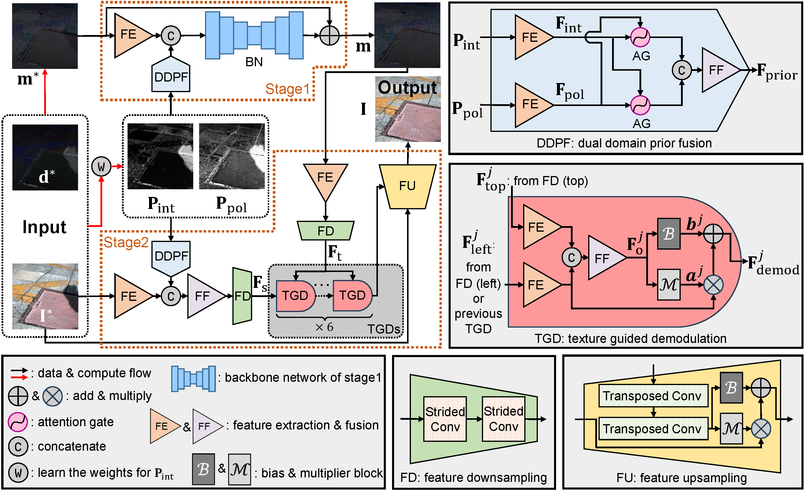

# Polarization Guided Mask-Free Shadow Removal

By [Chu Zhou](https://fourson.github.io/), Chao Xu, [Boxin Shi](http://ci.idm.pku.edu.cn/)


[PDF](https://ojs.aaai.org/index.php/AAAI/article/download/33164/35319) | [SUPP](https://fourson.github.io/assets/pdf/AAAI2025a_supp.pdf)

## Abstract
Shadow is a phenomenon that degenerates image quality and decreases the performance of downstream vision algorithms. Despite the fact that current image shadow removal methods have achieved promising progress, many of them require an externally obtained shadow mask as a necessary part of the input data, which not only introduces additional workload but also leads to degenerated performance near the shadow boundary due to the inaccuracy of the mask. Some of them do not require the shadow mask, however, they need to simultaneously consider the restoration of the brightness and color information along with the preservation of the texture and structure information inside the shadow region without external clues, which poses highly ill-posedness and makes the results prone to artifacts. In this paper, we propose **Pol-ShaRe**, the first **Pol**arization-guided image **Sha**dow **Re**moval solution, to remove shadow in a mask-free manner with fewer artifacts. Specifically, it consists of a two-stage pipeline to relieve the ill-posedness and a neural network tailored to the pipeline to suppress the artifacts. Experimental results show that our Pol-ShaRe achieves state-of-the-art performance on both synthetic and real-world images.

## Prerequisites
* Linux Distributions (tested on Ubuntu 22.04).
* NVIDIA GPU and CUDA cuDNN
* Python >= 3.8
* Pytorch >= 2.2.0
* cv2
* numpy
* tqdm
* tensorboardX (for training visualization)

## Usage
* Download the [pre-trained model](https://1drv.ms/u/s!ArUakeQPD3mnhBYzxtaVS5TVMexH?e=Ycb7uI) (`full.pth`) into the `checkpoint` folder
* Use `python execute/infer_full.py -r checkpoint/full.pth --data_dir <path_to_input_data> --result_dir <path_to_result_data> --data_loader_type InferDataLoader default` for inference
* Use `notebooks/visualize_npy.py` to visualize the results
  
## Train your own model for diverse real scenes
* Edit the hyper-parameters in `PolShadowEngine` (which can be found in `scripts/script_utils/PolShadowEngine.py`) to fit your conditions
* Download [DatasetSourceFiles](https://1drv.ms/f/s!ArUakeQPD3mneJhFvybQmjhoP9I?e=Qy1vyp) and [SynShadow/matte](https://drive.google.com/file/d/1RErNUbkstaiCchYzbe8wPYTEdU-Yp7o0/view?usp=drive_link)
* Run `python scripts/make_dataset_for_train.py` and `python scripts/make_dataset_for_test.py` respectively
* Run `python execute/train.py -c config/subnetwork1.json` and `python execute/train.py -c config/subnetwork2.json` independently, then run `python execute/train.py -c config/full.json --subnetwork1_checkpoint_path <path_to_subnetwork1_checkpoint> --subnetwork2_checkpoint_path <path_to_subnetwork2_checkpoint>`

## Others
* Note that all config files (`config/*.json`) and the learning rate schedule function (MultiplicativeLR) at `get_lr_lambda` in `utils/util.py` could be edited
* It's open to design your own weighting function (the `mapping_func` in `utils/util.py`) and priors (the `calc_prior_i` and `calc_prior_p` in `utils/util.py`) to fit your scene

## Citation
If you find this work helpful to your research, please cite:
```
coming soon
```
